# 2025's Top 12 Best AI Workspace Tools

Tired of wrestling with complex formulas in Google Sheets or spending hours formatting presentations? You're manually copying prompts between ChatGPT and your spreadsheets, losing time on repetitive tasks that AI could handle in seconds. The productivity gap between people using AI workspace add-ons and those still doing everything manually grows wider every day.

These AI-powered extensions transform Google Sheets, Docs, and Slides into intelligent automation machines that generate content, analyze data, and create visualizations through simple natural language commands. You'll discover tools offering everything from bulk content generation to live data integration, with pricing ranging from generous free plans to enterprise subscriptions.

## **[AiAssistWorks](https://www.aiassistworks.com)**

The most affordable AI workspace add-on with 100+ models and zero formula complexity.

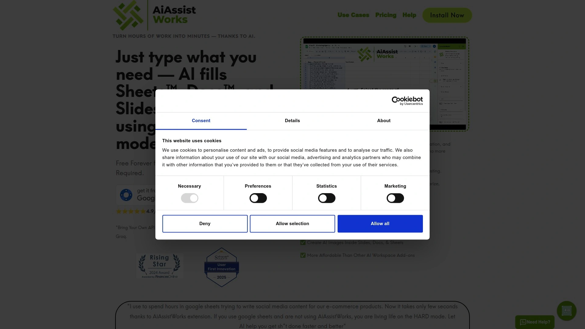

AiAssistWorks eliminates the need for complicated formula functions like =GPT() by providing a straightforward interface where you select tasks, choose data, and let AI handle execution automatically. The platform grants access to over 100 AI models, giving you flexibility to switch between providers based on performance needs or cost considerations without changing tools.

The tool processes up to 1,000 Google Sheet rows when running bulk operations, significantly outperforming competitors that limit batch processing to smaller chunks. This massive capacity matters when you're generating product descriptions for an entire e-commerce catalog or analyzing thousands of survey responses simultaneously. You bring your own API key from preferred providers like OpenAI, Anthropic, or others, maintaining full control over costs and model selection.

Fill the Sheets functionality generates content across multiple cells with one action—no dragging formulas down columns or combining functions manually. For Google Docs users, the summarization and rewriting features work directly within documents, transforming how you edit long-form content. Slide generation in Google Slides creates AI-powered presentations including image generation capabilities built right into the workflow.

The Lite plan stays free forever with 100 execution credits monthly, enough for casual users managing occasional automation tasks. Each cell filled consumes one credit while other features use 2-5 credits per result, creating transparent usage tracking. Security remains paramount—your API keys, prompts, and sheet content never touch their servers, with keys stored encrypted in your Google account only.

## **[Numerous.ai](https://numerous.ai)**

Natural language spreadsheet automation with exceptional bulk processing and classification power.

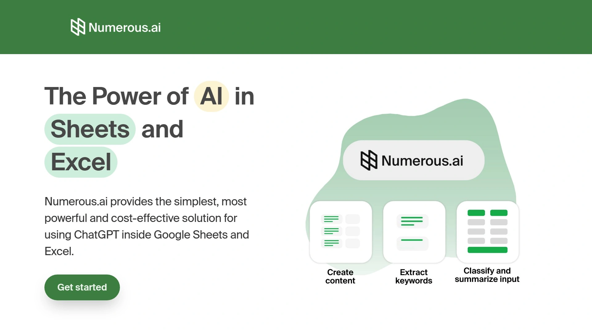

Numerous handles complex tasks like sentiment analysis, mass categorization, and SEO content generation through simple cell-dragging actions rather than formula writing. The platform excels at analyzing customer reviews, generating hashtags, and classifying products at scale—workflows that typically require hours of manual work or custom scripting.

The AI responds to any spreadsheet function through natural language prompts, returning results within seconds regardless of complexity. Type "Summarize the feedback in column B and group similar comments" and watch Numerous process hundreds of rows instantly. This natural interaction removes the learning curve that stops most people from leveraging spreadsheet automation effectively.

Content teams use Numerous for blog ideas, user feedback analysis, and SEO data extraction. Marketers spot campaign performance trends faster by asking questions about their data in plain English. E-commerce businesses automate product categorization and description generation across thousands of SKUs without touching traditional formulas.

The tool supports both Microsoft Excel and Google Sheets with identical functionality, preventing vendor lock-in. Over 650 companies rely on Numerous for time-intensive automation tasks where speed and accuracy determine competitive advantage. The interface prioritizes intuitive interaction over technical complexity, making sophisticated AI accessible to users who never learned advanced spreadsheet functions.

## **[Plus AI](https://plusai.com)**

Premium presentation creator that generates entire Google Slides decks from prompts or documents.

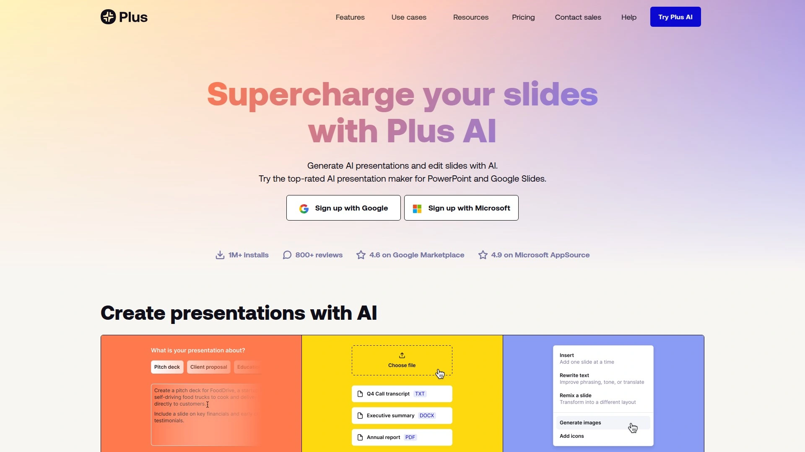

Plus AI dominates the Google Slides add-on marketplace with over 1 million installs and a 4.7-star rating, establishing it as the top-rated AI presentation tool. The platform creates complete presentations from text prompts or existing documents like PDFs, generating structured slides in minutes rather than hours.

The Edit with Plus AI feature inserts new slides, rewrites existing content, or remixes layouts without starting from scratch. Convert plain text slides into well-formatted three-column layouts by describing what you want. The design engine creates custom themes by analyzing your brand requirements—type theme preferences and watch AI select appropriate fonts, colors, and visual styles automatically.

Co-creation functionality provides slide-by-slide improvement suggestions, acting like an experienced presentation consultant reviewing your deck. Teams maintain consistent designs, styles, and tones across all presentations through shared themes and custom AI instructions. Translation capabilities generate slides in any language, making international presentations straightforward.

The Google Docs integration bundles with Slides access at the same subscription price, doubling value for users needing both tools. Pricing starts at $10 monthly with a seven-day free trial for testing workflows before commitment. Plus AI creates native Google Slides presentations, meaning output looks indistinguishable from manually created decks.

## **[SheetAI](https://www.sheetai.app)**

Proven AI spreadsheet assistant with 139,000 installs and unique brain memory feature.

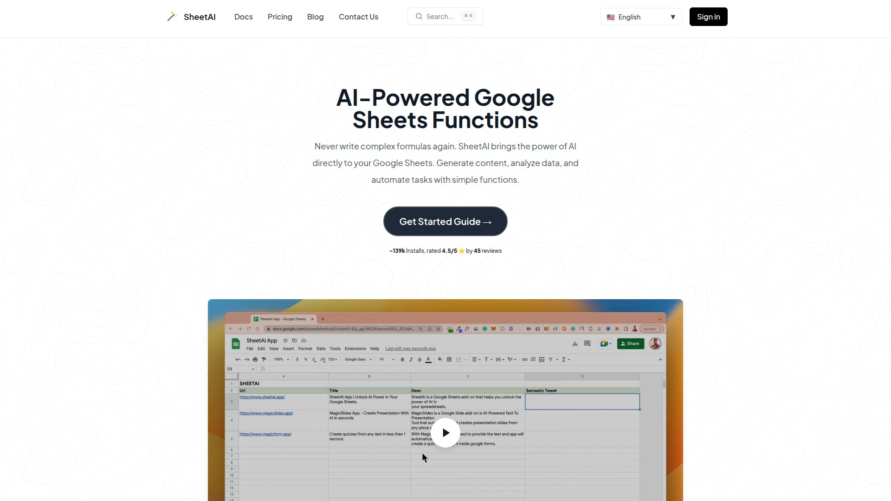

SheetAI brings ChatGPT and Gemini capabilities directly into Google Sheets through simple function calls rather than external copying. The platform maintains a 4.5-star rating across 45 reviews after accumulating over 139,000 installations, demonstrating sustained user satisfaction. Functions like =SheetAI() generate instant responses to plain English questions typed directly into cells.

The SHEETAI_BRAIN function stands out by training AI on your specific data via text or URLs, creating contextual responses based on your unique information rather than generic knowledge. This memory capability transforms the AI from a general assistant into a specialized expert on your business data, customer information, or product catalogs. The accuracy improvements from context-aware responses eliminate the typical "close but not quite right" frustration with generic AI.

SHEETAI_LIST generates organized lists, tables, and structured data instantly with AI-powered variations. SHEETAI_EXTRACT intelligently auto-fills spreadsheets by understanding context—complete product descriptions, standardize data formats, or extract specific information patterns across thousands of rows. These specialized functions handle distinct use cases better than one-size-fits-all approaches.

The tool works across all languages ChatGPT supports, removing English-only limitations that restrict international teams. Integration requires minimal setup—install from Google Workspace Marketplace, launch from the add-ons menu, and export desired functions to your sheet. The straightforward implementation gets teams productive within minutes rather than requiring extensive training.

## **[Synterrix](https://synterrix.com)**

Advanced spreadsheet AI with fine-tuning, bulk operations, and real-time web scraping.

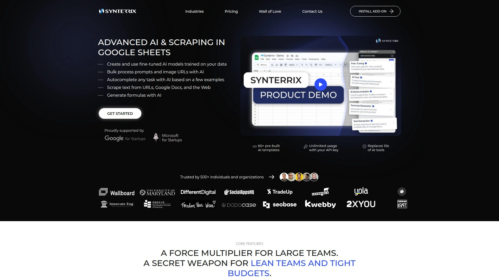

Synterrix differentiates through model fine-tuning capabilities that train AI on your content, creating outputs matching your brand tone, structure, and goals rather than generic results. This customization eliminates the "almost right" problem where AI-generated content requires extensive editing to match company voice or industry terminology.

The platform processes bulk operations through formulas or sidebar prompts, ideal for mass content creation, translations, or automating multi-row tasks. AI Autocomplete provides initial data points then completes remaining entries—perfect for generating SEO titles, extracting names from email addresses, or managing structured data at scale. Over 60 pre-built AI templates accelerate common workflows for SEO teams, e-commerce operations, and content production.

Google Search AI combines prompts with real-time search results to research multiple items simultaneously—like identifying company types or gathering competitive intelligence—saving hours of manual investigation. Text extraction pulls specific data from web pages or Google Docs directly into your spreadsheet, scaling product details, descriptions, or SEO content collection. Image processing sends image URLs from sheets to AI with custom instructions for batch tagging, alt text generation, or item classification.

The formula generator converts plain language task descriptions into correct Google Sheets formulas instantly, removing technical barriers. Free three-day access lets you test full capabilities risk-free before deciding on paid plans. More than 650 companies use Synterrix for its budget-friendly pricing and intuitive interface.

## **[Coefficient](https://coefficient.io)**

Live business data connector that syncs CRM and database information directly into sheets.

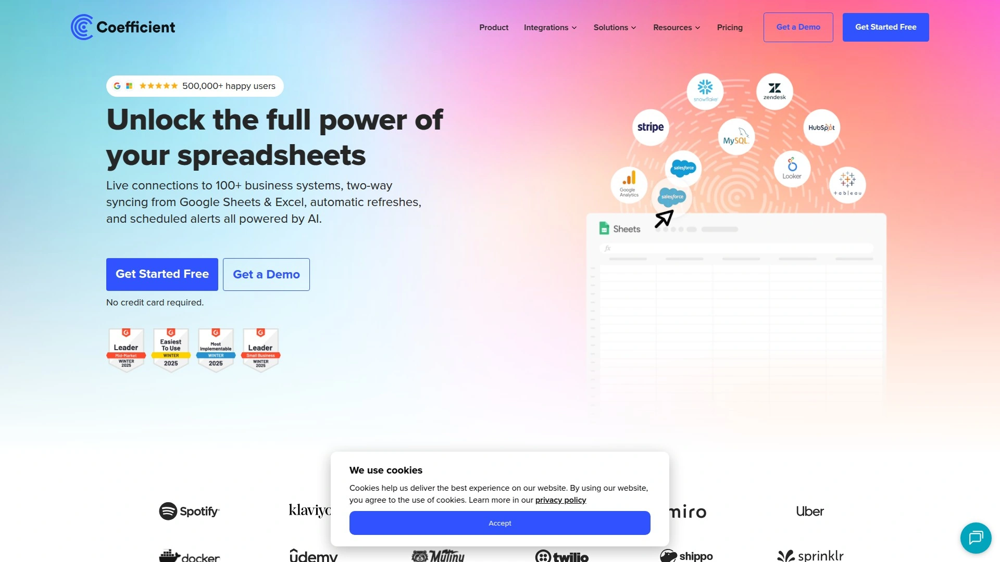

Coefficient solves the critical problem of stale spreadsheet data by connecting Google Sheets to live business systems like Salesforce, Shopify, Tableau, and Snowflake. Text instructions pull any needed business data automatically, eliminating manual exports and imports that quickly become outdated. This real-time connectivity transforms sheets from static snapshots into dynamic dashboards reflecting current business state.

The GPT Copilot family of =GPTX() functions enables powerful spreadsheet operations for cleaning, formatting, querying, enriching, and analyzing data without leaving sheets. Chat with GPT directly from your spreadsheet rather than context-switching to external AI tools. The platform combines live web data with ChatGPT capabilities, unlocking use cases spanning industry news monitoring, competitor analysis, market trends, customer review aggregation, and social media analytics.

Auto-generation of formulas, pivot tables, and charts happens through text instructions—type what you need in English and GPT Copilot creates the technical implementation. This natural language interface makes advanced spreadsheet functionality accessible to team members who never mastered traditional formula syntax. The result is democratized data analysis across organizations rather than bottlenecking insights through technical specialists.

Integration with business systems positions Coefficient as infrastructure for data-driven operations rather than just another AI helper. Companies managing substantial data across multiple platforms benefit most from unified access through spreadsheet interfaces everyone already knows. Early access availability lets forward-thinking teams explore cutting-edge AI spreadsheet capabilities before general release.

## **[SheetMagic](https://sheetmagic.ai)**

Unlimited ChatGPT usage with web scraping built directly into Google Sheets workflows.

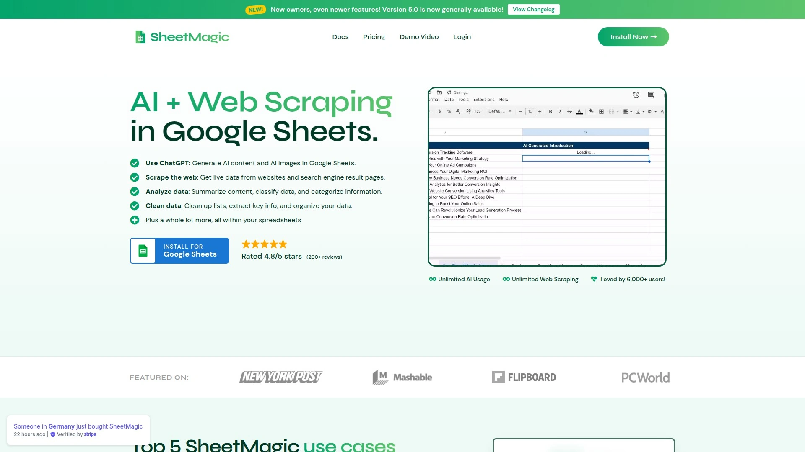

SheetMagic delivers unlimited AI interactions by using your OpenAI API key, eliminating per-query charges or monthly credit limits common with competitor tools. The =AI("Your Prompt Here") function returns responses in seconds, with blazing-fast optimization ensuring minimal wait times even during batch operations.

Web scraping functionality inputs URLs and retrieves full page content directly into sheets, enabling AI interaction with live website data. This combination of content extraction and AI analysis automates competitive research, price monitoring, or information gathering workflows that typically require multiple tools. Search engine result page scraping captures rankings, featured snippets, or competitor visibility at scale.

Cell combining links multiple cells into unified prompts, creating context-aware responses that reference related data automatically. The prompt library includes effective templates for common use cases, accelerating productivity for new users. Multi-language support processes prompts in any ChatGPT-supported language, serving international teams without English-only restrictions.

Team-oriented pricing plans enable organization-wide deployment without per-user multiplication of costs. By using your own API key, you pay OpenAI's direct rates without markup, ensuring the cheapest possible usage cost. The tool exports content in CSV format ready for uploading to websites, CMSs, or other systems.

## **[Formula Bot](https://formulabot.com)**

Comprehensive data analytics platform evolved beyond simple formula generation.

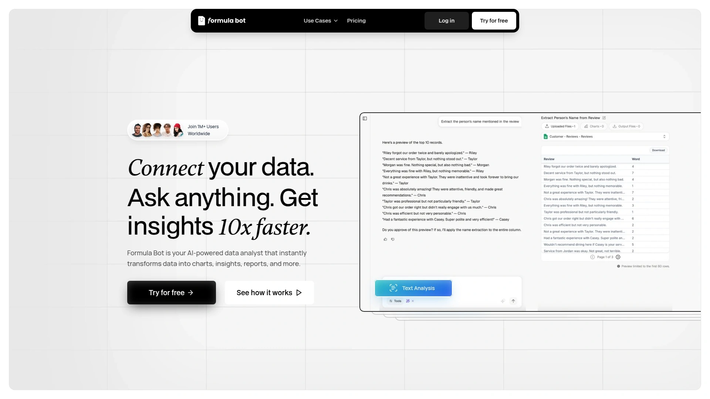

Formula Bot started as an Excel formula generator but matured into a multi-purpose data analytics interface handling quantitative and qualitative analysis across Excel, Google Sheets, Google Analytics, and additional sources. The evolution reflects understanding that formula generation alone doesn't solve the broader challenge of extracting insights from data.

The AI assistant operates directly within spreadsheets, providing formula generation, data analysis, and automation without external tool switching. Integration with platforms like Salesforce and Google Docs enables robust cross-system analysis that considers data from multiple sources simultaneously. This connectivity matters when answering questions requiring information synthesis beyond single spreadsheet contents.

Automated data visualization helps users create appropriate charts and graphs based on dataset characteristics rather than manually testing options. The sentiment analysis, content extraction, and script generation capabilities extend functionality into text processing and workflow automation. Free tier provides 5 generations monthly, 10 data analyzer messages, and 20 AI automations—enough for occasional users to benefit without payment.

Enterprise-grade security practices protect customer information through industry-standard methods. The tool generates hundreds of Excel formula types, making advanced spreadsheet functionality accessible to users who never memorized syntax. Pro plans at $9 monthly increase generation limits for power users managing higher volumes.

## **[SlidesAI.io](https://www.slidesai.io)**

Fast presentation generator creating stunning decks in Google Slides and PowerPoint.

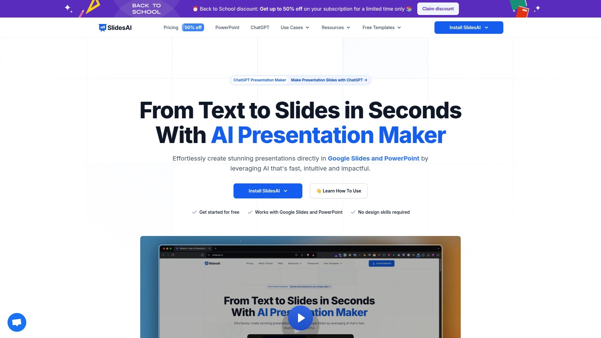

SlidesAI generates professional presentations directly in Google Slides and PowerPoint through intuitive prompts that describe content needs. The platform emphasizes speed and visual impact, producing polished decks quickly enough to meet same-day deadlines or last-minute requests. This velocity proves crucial when opportunities emerge requiring immediate presentation materials.

The tool handles complete presentation creation from topic descriptions, structuring content logically while applying appropriate formatting and design elements. Users avoid the blank slide paralysis that delays projects—describe your topic and watch AI assemble a coherent narrative flow. Image selection, text formatting, and layout choices happen automatically based on content type and presentation purpose.

Installation through Google Workspace Marketplace takes minutes, with immediate access to AI generation capabilities after authorization. The interface prioritizes simplicity over complexity, making professional presentation creation accessible to users uncomfortable with traditional design software. Templates and themes ensure output maintains visual consistency across slides.

SlidesAI serves students, business professionals, educators, and anyone needing presentation materials without design expertise or time for manual creation. The platform removes technical barriers between ideas and finished presentations, democratizing access to professional-quality decks. Free tier availability lets users test capabilities before committing to paid plans for expanded features.

## **[SheetGPT](https://www.sheetgpt.ai)**

Content summarization specialist excelling at insight extraction and classification tasks.

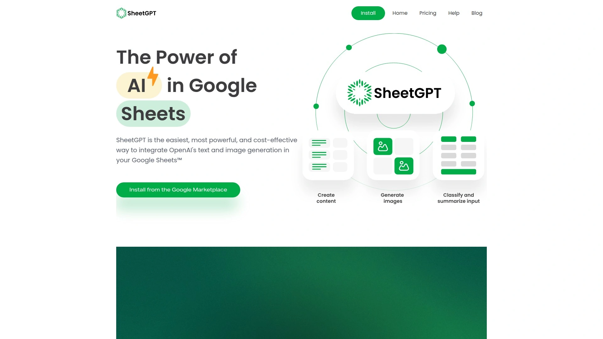

SheetGPT focuses on summarizing content and extracting relevant insights from large data sets, making it particularly valuable for analyzing customer reviews, survey responses, or text-heavy information. The classification and categorization capabilities transform messy unstructured text into concise, readable categories ready for decision-making.

The platform processes bulk content through integrated AI functions that reference multiple data points simultaneously. This context awareness improves accuracy when summarizing related information or identifying patterns across datasets. Team plans enable organization-wide access with features like shared prompts and collaborative workflows.

Professional tier pricing at $99 monthly includes 10 million GPT-3.5 words or 750 images with organization-wide access and email support. This generous allocation suits content-heavy businesses managing substantial text processing requirements. The tool works equally well with Google Sheets and Microsoft Excel, preventing platform lock-in.

Custom AI model training creates outputs tailored to specific brand voices, industry terminology, or audience expectations. This fine-tuning capability distinguishes SheetGPT from generic tools producing one-size-fits-all content requiring extensive editing. Integration simplicity gets teams productive quickly without prolonged onboarding or technical implementation projects.

## **[Alayna AI](https://alayna.ai)**

Google Slides generator with image integration, diagrams, and lecture support features.

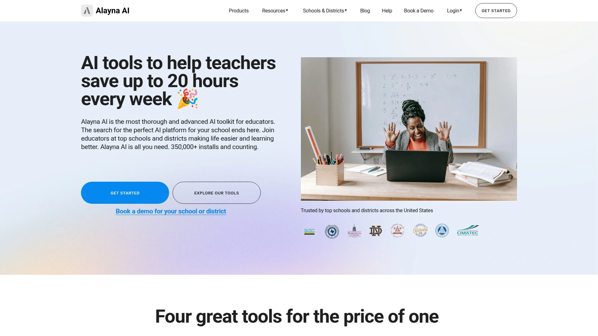

Alayna AI creates and edits presentations in minutes, complete with automatically selected images, diagrams matching content, and beautiful themes. The lecture support functionality particularly benefits educators and trainers creating instructional materials where visual clarity and information hierarchy matter for student comprehension.

The platform handles both generation of new presentations from scratch and editing of existing decks needing updates or improvements. This dual capability serves different workflows—rapid creation when starting fresh versus enhancement when refining previous work. Theme selection algorithms analyze content type and audience to recommend appropriate visual styles.

Diagram generation interprets concepts described in text and creates visual representations automatically, eliminating the manual design work typically requiring dedicated graphics software. This feature proves especially valuable for technical presentations, process explanations, or educational content where diagrams clarify complex relationships. Image selection considers slide context to choose relevant, professional visuals from integrated libraries.

The tool integrates directly with Google Slides through the Workspace Marketplace, maintaining native functionality and collaboration features. Output remains fully editable within Google Slides, allowing manual refinements after AI generation. Free installation and testing enable risk-free evaluation before potential premium upgrade decisions.

## **[Gemini in Google Sheets](https://workspace.google.com)**

Native Google AI integration creating tables, formulas, and insights without third-party add-ons.

Gemini integrates directly into Google Sheets as a native feature rather than requiring third-party add-on installation, providing AI capabilities to all Workspace users. The sidebar interface accepts plain English requests like "Summarize responses in Column B" or "Create a formula calculating growth rate between columns". This native integration ensures compatibility and removes installation friction.

The AI generates complete tables from descriptions, creates complex formulas automatically, produces data analysis and insights, and builds charts and graphs based on dataset characteristics. Advanced language understanding interprets intent behind prompts, delivering appropriate responses even when requests use imprecise terminology. Desktop-only availability currently limits mobile usage but reflects the reality that serious spreadsheet work happens on larger screens.

Gemini processes structured data most effectively, preferring organized sheets over scattered entries. The tool works best with existing data rather than empty sheets, analyzing patterns and relationships to provide meaningful insights. Multi-step requests handle complex workflows—like finding duplicates, highlighting them, then generating summary statistics—through conversational interaction.

The sidebar remains persistently available while working, enabling iterative refinement of queries and outputs. Results appear as actionable suggestions you can accept, modify, or reject, maintaining human control over final implementation. Google Workspace accounts access Gemini automatically without separate subscriptions, though some features require specific workspace plans.

## FAQ

**Do these AI tools work with both Google Sheets and Microsoft Excel?**

Most tools support both platforms, though some specialize in Google Workspace. Numerous.ai, Synterrix, Formula Bot, and SheetGPT function identically in Excel and Google Sheets, preventing vendor lock-in. Plus AI, SlidesAI, and Alayna AI focus specifically on Google Slides but deliver native integration advantages. SheetAI and AiAssistWorks prioritize Google Workspace but provide the deepest feature sets for those platforms. Check individual tool documentation if Excel compatibility matters for your workflow—cross-platform tools typically maintain feature parity while Google-focused tools offer specialized Workspace integrations.

**How do pricing models work for AI workspace add-ons?**

Two main models dominate: subscription plans with included credits and bring-your-own-key systems. Subscription tools like Plus AI charge monthly fees including AI usage—starting around $10 for individual plans, scaling to enterprise pricing for teams. Bring-your-own-key platforms like AiAssistWorks and SheetMagic charge for software access while you pay AI providers directly for model usage, often reducing total costs. Free tiers exist across most tools—AiAssistWorks offers 100 credits monthly forever, Formula Bot provides 5 generations, and Gemini integrates with existing Workspace subscriptions. Test free options before committing to paid plans to verify the tool matches your specific workflows.

**Can I generate content for thousands of rows simultaneously with these tools?**

Yes, bulk processing capabilities vary by tool but most handle large-scale operations. AiAssistWorks processes up to 1,000 rows in single batch operations, significantly exceeding typical limits. Numerous.ai and Synterrix specialize in mass content generation, classification, and analysis across thousands of entries through simple cell-dragging actions. SheetMagic and Coefficient enable unlimited concurrent operations limited only by API rate limits and your processing credits. The key advantage over manual ChatGPT usage is eliminating repetitive copying and pasting—set up your prompt structure once, apply across entire datasets, and let AI process everything in minutes rather than hours.

## Conclusion

Choosing your ideal AI workspace tool depends on whether you prioritize presentation creation, spreadsheet automation, live data connectivity, or cross-platform flexibility. Each platform brings distinct strengths—some excel at bulk content generation, others focus on visual presentation polish, and several specialize in connecting business systems. [AiAssistWorks](https://www.aiassistworks.com) delivers exceptional value for teams needing comprehensive Google Workspace automation without vendor lock-in, combining access to 100+ AI models with industry-leading 1,000-row batch processing at the most affordable pricing structure. The bring-your-own-key model keeps costs transparent and controllable while the free-forever Lite plan removes barriers for individual users and small teams testing AI-powered workflows before scaling up.

[11](https://skywork.ai/skypage/en/Synterrix-(Spreadsheet-Daddy)-Your-AI-Companion-for-Google-Sheets/1976545271816581120)
